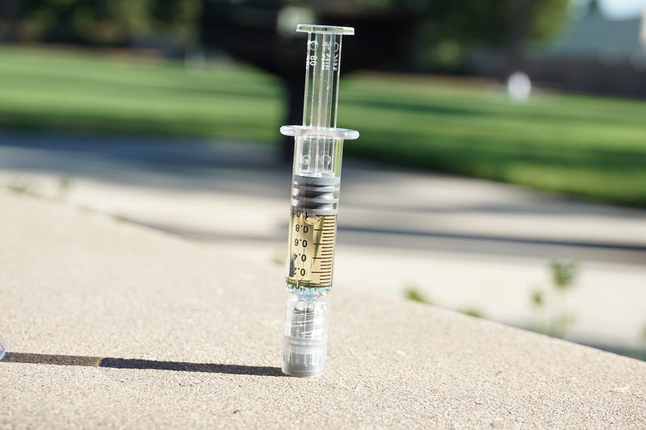
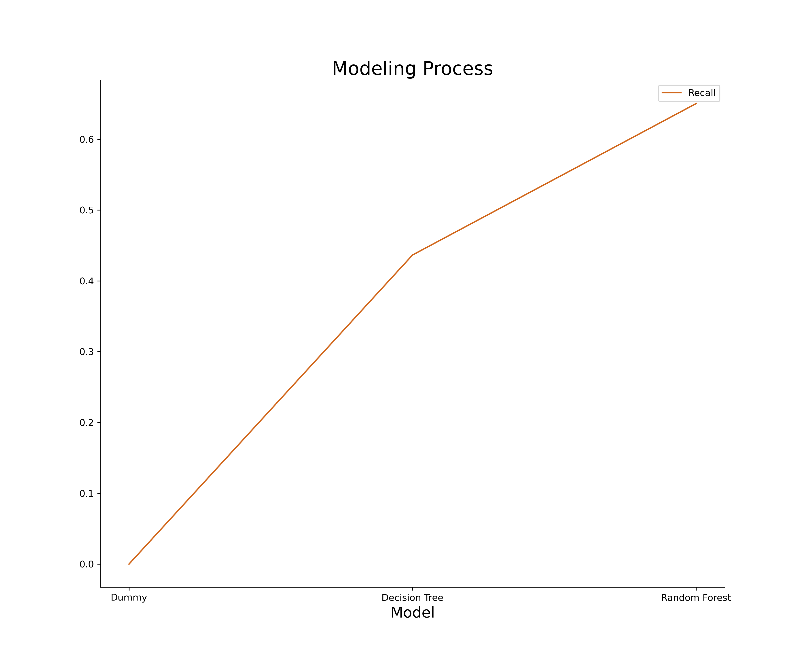
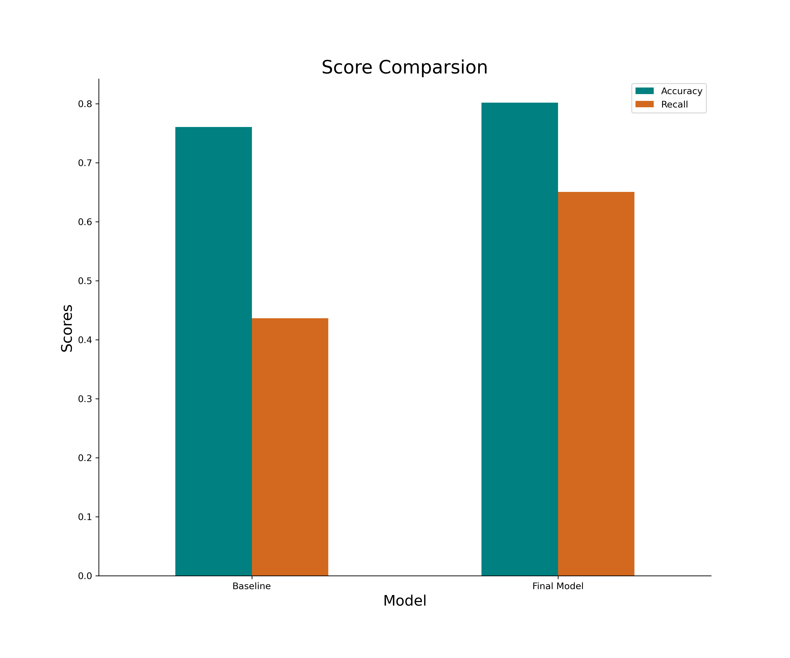
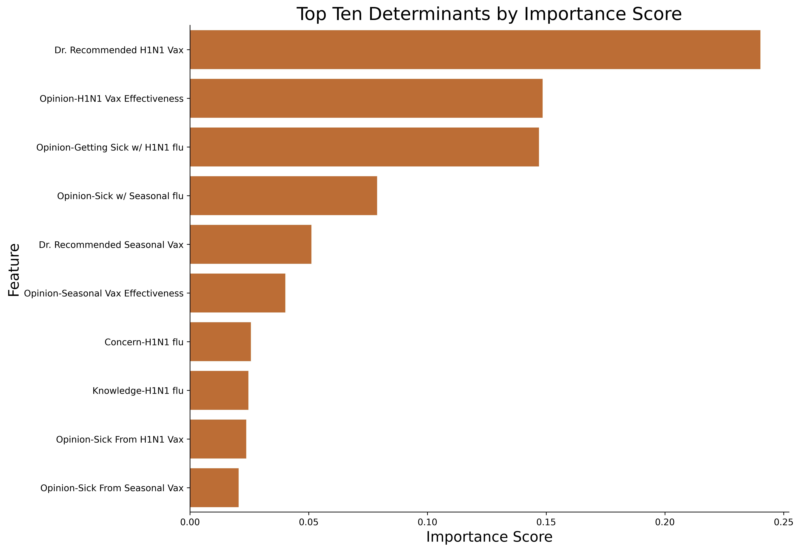

# Immunization Predictor



**Author**: Clara Giurgiu


## Overview

**TechHealth Access** is an organization that combines technology and service as it strives to educate healthcare providers and public health officials on how to use modern technology to better help their patients and communities.
The project aims to develop an algorithm that can predict people or groups of people that will most likely not get a novel vaccine such as the H1N1 vaccine in 2009.
The algorithim can be used by health care providers and public health agencies to predict those that might not get vaccinations and face risk of potential complications from preventable diseases. 

## Business Problem

Our company believes vaccine development and acceptance are key to stop the spread of existing and novel infectious diseases and pandemics as we recently experienced with COVID-19.\
With a prediction model that classifies whether or not someone gets a vaccine, we can address areas such as vaccine hesitancy and misinformation and how public health agencies can address them to impact immunization rates. 

## Data Understanding

The National 2009 H1N1 Flu Survey (NHFS) data colleted over the phone to monitor influenza immunizations during the 2009-10 flu season and in response to the 2009 H1N1 pandemic and it has over 26 thousand responses. It asked whether the respondants had received the H1N1 and seasonal flu vaccines as well as their social, economic and demographic backgrounds.

## Data Preparation & Analysis

The data is separated in two datasets with 26,707 responses. One with 35 columns with the survey answers of the respondents' backfround information and one column with an assigned ID. The second dataset had the binary target, vaccination status of the respondants with the corresponding ID. I merged the sets based on the matching ID column.
It had 14,653 nulls across different columns, and I used sklearn's SimpleImputer to fill them with the most frequent value in their respective columns and all categorical features were encoded using sklearn's OneHotEncoder. 


## Modeling

I chose *recall* as my primary evaluation metric for my models because this is a measure of how many cases we predict will not get the vaccine, and they truly don't get it. 
With false negatives, we can't confidently determine what factors might lead groups not to get vaccinated and the goal is to direct our efforts to improve on those

- The **Dummy Model** had an **accuracy** score of **0.78** and **recall** score of **0.0.** The false negatives were expected since there was an vast class imbalance in the vaccination rates, with 0 or no vaccine being the most common. 

- The **Decision Tree** had no tuning of hyperparamenters and achieved an **accuracy** score of **0.760** and **recall** score of **0.437.**

- The final model was a **Random Forest** with the best parameters found through a grid search. The **accuracy** improved to **0.808** and recall to **0.651.**




## Conclusions

Comparing the accuracy and recall scores from all three models, the third model had the highest accuracy of 80% with a recall score of 65%. I recommend that health care providers and public health agencies use this model as its application can help in predicting who will be at risk of not receiving immunizations.

Additionally it shows that some top determinants for that choice are recommendation from a physician to get the vaccine, general thoughts about the vaccine effectivenes and the risk of getting sick with the H1N1 flu. With that in mind, provider can identify the best way to improve on those areas and education their patients.  


## Next Steps

More recent data is needed to make more accurate predictions, since the dataset was from 2009 and trends are always changing based on the information available, there have new developments in vaccines and diseases such as the COVID-19 pandemic.

The final model, although much improved from the baseline, could also benefit from more tuning. However, this would require more time.

## For More Information

See the full analysis in the [Jupyter Notebook](https://github.com/claragiurgiu/Immunization-Predictor/blob/main/Immunization_Predictor_Analysis.ipynb)

## Repository Structure

```
├── Data
├── Images
├── .gitignore
├── Immunization_Predictor_Analysis.ipynb
├── Immunization_Predictor_Presentation.pdf
├── LICENSE
└── README.md
